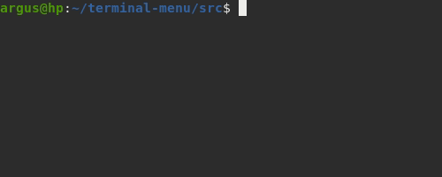

# Terminal Menu
Creates a text-based menu in shell.

## Usage



## Document

### Types of fonts used
- REGULAR
- <b>BOLD</b>
- <i>ITALIC</i>
- <u>UNDERLINE</u>
- BLINK
- INVERT

### Types of foreground and background color
- <i style="color:gray">BLACK</i>
- <i style="color:red">RED</i>
- <i style="color:green">GREEN</i>
- <i style="color:yellow">YELLOW</i>
- <i style="color:blue">BLUE</i>
- <i style="color:magenta">MAGENTA</i>
- <i style="color:cyan">CYAN</i>
- <i style="color:white">WHITE</i>
- UNKNOWN
- DEFAULT

Example
```py
setFont(Font.BOLD)
setColor(FgColor.RED)
setBgColor(BgColor.WHITE)
print("Hello World")
```

### Show Menu List
Writes the given list to the screen in the form of a menu and returns the selected item

Parameters
- title : <a>str</a> - The menu title that will be written to the screen
- options : <a>list [str]</a> - The menu options that will be written to the screen
- info : <a>str</a> - The digest information of menu that will be written to the screen afte menu title
- multiple : <a>bool</a> - Multiple choices
- selected : <a>list [str]</a> - To show the pre-selected ones 
```py
showMenu(title, options, info, multiple=False, selected=[]):

options = ['Start', 'Settings', 'Exit']
showMenu('Tasks', options):
```